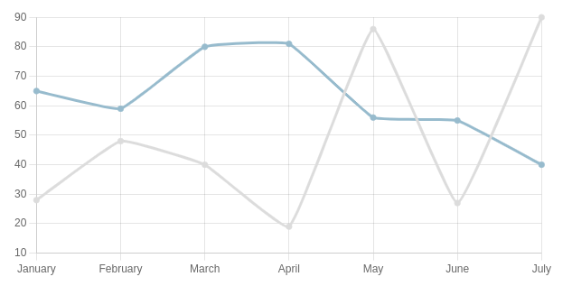

= Asciidoctor Chart
// Aliases:
:project-name: Asciidoctor Chart
:project-handle: asciidoctor-chart
// Variables:
:release-version: 1.0.0.alpha.1
:uri-repo: https://github.com/asciidoctor/asciidoctor-chart
// Settings:
:idprefix:
:idseparator: -

image:https://github.com/asciidoctor/asciidoctor-chart/workflows/Ruby/badge.svg[link=https://github.com/asciidoctor/asciidoctor-chart/actions?query=workflow%3ARuby]
image:https://img.shields.io/gem/v/asciidoctor-chart?include_prereleases&style=plastic[link=https://rubygems.org/search?query=asciidoctor-chart]

A set of Asciidoctor extensions that adds a chart block and block macro for including charts powered by https://c3js.org/[C3.js], https://gionkunz.github.io/chartist-js/[Chartist], or https://www.chartjs.org/[Chart.js] in your AsciiDoc document.

== Prerequisites

All that's needed is Ruby 2.5 or better (or JRuby 9.2 or better) and a few Ruby gems (including at least Asciidoctor 2.0.0), which we explain how to install in the next section.

To check if you have Ruby available, use the `ruby` command to query the version installed:

 $ ruby -e 'puts RUBY_VERSION'

Make sure this command reports a Ruby version that's at least 2.5.
If so, you may proceed.

== Getting Started

You can get {project-name} by <<install-the-published-gem,installing the published gem>>.
ifndef::env-site[You can also <<development,run the code from source>> if you want to use a development version or participate in development.]

=== Install the Published Gem

To install {project-name}, first make sure you have satisfied the <<Prerequisites,prerequisites>>.
Then, install the gem from RubyGems.org using the following command:

 $ gem install asciidoctor-chart --pre

=== Enable the Extension

Assuming all the required gems install properly, you can enable the extension using `--require` option (or `-r` for short) from the Asciidoctor CLI:

 $ asciidoctor --require asciidoctor-chart my-doc.adoc

=== Usage

Line chart powered by C3.js (default) declared as a literal block::
+
----
[chart,line]
....
January,February,March,April,May,June,July
28,48,40,19,86,27,90
65,59,80,81,56,55,40
....
----
+

Line chart powered by Chart.js declared as a block macro with a CSV file as target::
+
----
chart::sample-data.csv[line,engine="chartjs"]
----
+

For more examples, see {uri-repo}/blob/master/examples/example.adoc[example.adoc].

== Authors

{project-name} was written by https://github.com/mogztter/[Guillaume Grossetie].

== Copyright

Copyright (C) 2014-2020 Guillaume Grossetie
Free use of this software is granted under the terms of the MIT License.

For the full text of the license, see the <<LICENSE.adoc#,LICENSE>> file.
